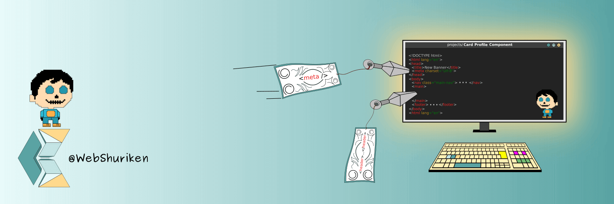

### Hi Visitors 👋

My passion for coding began when I was 10 and used MS-DOS to play a game.
Things did not go as planned so ended up in a different career. Enough is enough, now it't time to do what I love which is coding.
I want to specialise in frontend development although backend is also on the cards.

- 🔭 I’m currently working on #100 Days of Code Challenge and CS50W.
- 🔭 Going through Free Code Camp to get more experience with their tutorials and projects.
- 🌱 With it Im learning all I can regarding web technology, 1 technology at a time.
- 👯 Collaboration on here still new to me so if you have a Readme which needs updating or maybe JS bug testing let us work together.
- 📫 How to reach me:
  - email: carlos.alford@gmail.com
  - twitter: @webshuriken
- ⚡ Fun fact: Used to play tennis competitively even had a rank.. many moons ago.
